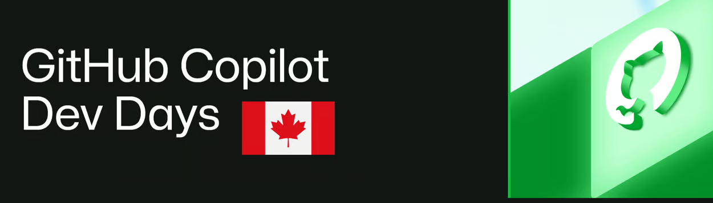

# Dev Days Canada

> A community-driven group for builders who live in the GitHub ecosystem.

Dev Days Canada is GitHub-centric and tool-agnostic. It brings together
developers using GitHub Copilot, Claude Code, Cursor, Codex, and other tools
that help them ship.

> **Join Dev Days Canada** — See upcoming events and join the community.
> [Open Dev Days Canada](https://aka.ms/ghcp-dev-days-canada)

[← Back to Canada Events](../README.md#-canada-events)

---

## Upcoming events

Event dates and registration details will be published here as they are
announced.

[View the latest Dev Days Canada events](https://aka.ms/ghcp-dev-days-canada)

---

## Topic Catalog

Sessions delivered through Dev Days Canada have covered:

| Speaker | Topic(s) |
|---|---|
| Ve Sharma | Building Non-Deterministic CI Gates; Teaching Your CI/CD Pipeline to Think; Agent Quality & Token Optimization; Redefining the Agentic SDLC; Welcome |
| Ian Reay | Ticket Driven Development |
| Diego Casati / Ray Kao | Agentic Platform Engineering with GitHub Copilot for IDP Evolution |
| Keyaan Al-Kheder | Advanced GitHub Copilot: Workflows, Scopes & AI-Powered Coding in VS Code |
| Brent Fox | From Requirements to Running Code with Pronghorn, GitHub Spec Kit, and Secure Azure Landing Zone |
| Terry | Agentic Development in Practice: Building Orbit with GitHub Copilot |
| Ricardo Covo | Agent Package Manager (APM) Agentic Workflows; Intro to the GitHub Copilot App |
| Jack Lee | Supercharging Your GitHub Copilot with Microsoft Learn MCP Server |
| Andrew Eisenberg | Building an Agentic Code Review Tool using the Copilot SDK |
| Adam Webb | BYOK with GitHub Copilot & Foundry |
| Poonam Upadhyay | Foundry Toolkit with GitHub Copilot & VS Code |
| Jeremy Moseley | How 5 Engineers Ship 200 PRs a Week |
| Rahmat Fedayizada | Agentic DevOps with Azure SRE Agent |
| Hammad Aslam | Your Terminal Has an Agent: GitHub Copilot CLI Deep Dive |
| Max Yermakhanov | GitHub Copilot for DevOps Engineers |
| Bruno Capuano | Let's Talk About Foundry: Local and Cloud |
| Mark Gottselig | GitHub @ MNP |

---

## Recordings

Recordings and supporting resources will be added here as sessions become
available.

---

## Get in touch

Questions, session ideas, or workshop nominations? Email the GitHub @ Canada
team at
[GitHubCopilotCanada@microsoft.com](mailto:GitHubCopilotCanada@microsoft.com).
