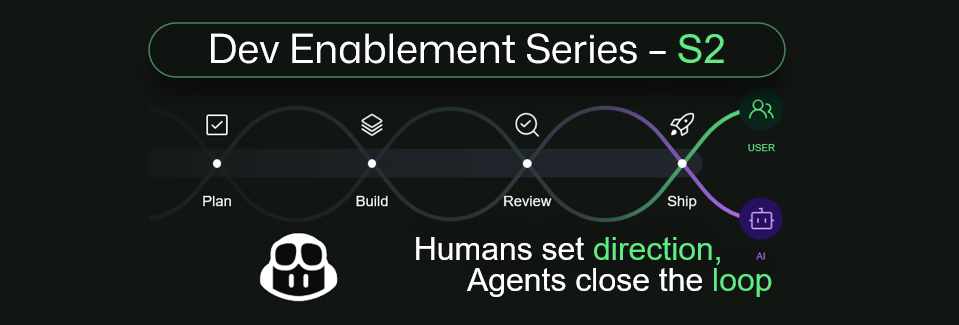

# Dev Enablement Series

> Practical sessions for modernizing software development with GitHub Copilot
> and AI-powered engineering practices.

*Humans set direction. Agents close the loop.*

[← Back to Canada Events](../README.md#-canada-events)

---

## Season 2: Innovate with GitHub as the Agent-Native Engineering System

**Software development is entering a new era.** Join us to explore how GitHub
and Microsoft are helping organizations transform software delivery with AI,
intelligent agents, enterprise-scale governance, and built-in security.
Discover practical strategies to scale with confidence, innovate faster, and
build software with trust in the age of AI.

**8 live webinars · August–December 2026 · 2:00 PM EST**

## Upcoming webinars

Join the series for practical guidance on the next era of software delivery.

| Date & Time | Session | Registration |
|---|---|---|
| Aug 26, 2026, 2:00 PM EST | Spec Driven Development with GitHub Copilot | [Register](https://msit.events.teams.microsoft.com/event/msit.1ad44c39-a59b-4ba7-b639-92222f9d156b@72f988bf-86f1-41af-91ab-2d7cd011db47?source=des-home-page) |
| Sept 9, 2026, 2:00 PM EST | GitHub Copilot: Optimizing Usage and Controlling Cost | [Register](https://msit.events.teams.microsoft.com/event/msit.088c8158-b740-49d5-82ba-b22886764bc4@72f988bf-86f1-41af-91ab-2d7cd011db47?source=des-home-page) |
| Sept 23, 2026, 2:00 PM EST | Using GitHub as The Agent-Native Engineering System | [Register](https://msit.events.teams.microsoft.com/event/msit.e16bb4a6-8b60-45fd-81b6-3c94ebaba1a9@72f988bf-86f1-41af-91ab-2d7cd011db47?source=des-home-page) |
| Oct 7, 2026, 2:00 PM EST | Unleash productivity with the GitHub Copilot CLI | [Register](https://msit.events.teams.microsoft.com/event/msit.aa8865cb-b724-4f7f-a4bb-baa0568bde03@72f988bf-86f1-41af-91ab-2d7cd011db47?source=des-home-page) |
| Oct 21, 2026, 2:00 PM EST | GitHub Copilot App: Your New AI Workspace | [Register](https://msit.events.teams.microsoft.com/event/msit.03eea064-c47f-45ed-b191-3bb6a6b563f2@72f988bf-86f1-41af-91ab-2d7cd011db47?source=des-home-page) |
| Nov 4, 2026, 2:00 PM EST | Connect Everything: Using MCP to Extend GitHub Copilot | [Register](https://msit.events.teams.microsoft.com/event/msit.9c823284-e443-48a2-80d9-97250b46f8d9@72f988bf-86f1-41af-91ab-2d7cd011db47?source=des-home-page) |
| Nov 11, 2026, 2:00 PM EST | GitHub Universe 2026: Key Announcements and What They Mean for Your Team | [Register](https://msit.events.teams.microsoft.com/event/msit.96735187-4859-468c-8d40-7c782eaa05ce@72f988bf-86f1-41af-91ab-2d7cd011db47?source=des-home-page) |
| Dec 2, 2026, 2:00 PM EST | AI-Native Development with GitHub Agentic Workflows | [Register](https://msit.events.teams.microsoft.com/event/msit.84664fb4-d4ca-41b6-b48a-2a94d93d47c2@72f988bf-86f1-41af-91ab-2d7cd011db47?source=des-home-page) |

---

## Key learnings

Season 2 follows work from intent to delivery, with practical ideas teams can
apply to their own engineering systems.

- Turn product intent into implementation-ready specifications with GitHub Copilot.
- Adopt agent-native workflows across planning, building, review, and shipping.
- Bring Copilot into the terminal, a dedicated AI workspace, and connected tools through MCP.
- Measure usage, control cost, and make informed decisions about AI-assisted development.
- Translate GitHub Universe announcements into concrete next steps for your team.

---

## About the series

The Dev Enablement Series is a GitHub @ Canada learning program for engineering
teams modernizing how software is planned, built, reviewed, and delivered.
Sessions connect product capabilities to repeatable practices rather than
isolated demos.

- **Audience** — Developers, engineering leaders, platform teams, and technical program owners.
- **Format** — Focused live webinars with practical guidance for real engineering workflows.
- **Schedule** — Eight sessions from August 26 through December 2, 2026.

---

## Season 1 archive

Recording and deck links will be added after the resources are refreshed.

| Date & Time | Topic |
|---|---|
| Jan 28, 2026 2:00 PM EST | GitHub Copilot: A Developer's Day in the Life |
| Feb 11, 2026 2:00 PM EST | GitHub Copilot Coding Agents: From Backlog to Build |
| Feb 25, 2026 2:00 PM EST | Vibe Engineering with GitHub Copilot |
| Mar 11, 2026 2:00 PM EST | GitHub Copilot Extensibility: Connecting Your Tools and Services (MCP) |
| Mar 25, 2026 2:00 PM EST | Building non-deterministic CI gates: Teaching your CI/CD pipeline to think |
| April 8, 2026 2:00 PM EST | Azure Developer CLI & GitHub Copilot: From Zero to Cloud Infrastructure |
| April 22, 2026 2:00 PM EST | GitHub Advanced Security: Building Secure Code from the Start |
| May 6, 2026 2:00 PM EST | GitHub Copilot: Turning Code into Knowledge |
| May 26, 2026 2:00 PM EST | GitHub Copilot: Optimizing Usage and Controlling Cost |

---

## Get in touch

Questions about the series or ideas for a future session? Email the
GitHub @ Canada team at
[GitHubCopilotCanada@microsoft.com](mailto:GitHubCopilotCanada@microsoft.com).
